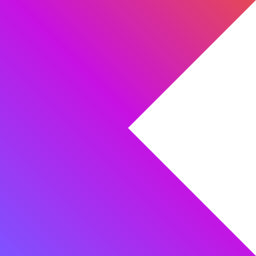
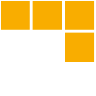

<body>
    

        

            <h1>Hey 👋, I'm Dante Rodríguez</h1>
        

        <h3 class="intro" align="center">Passionate technology student always eager to strengthen and expand his skills
            in this fascinating
            field.
        </h3>
    

    

        <!-- cards terminal -->
        

            <ul>
                <li>
                    <h3>Actualmente me encuentro cursando mi ultimo ciclo de estudios </h3>
                </li>
                <li>
                    <h3>Soy estudiante en TECSUP</h3>
                </li>
              <li>
                <h3>Visita mi Portfolio: <a href="https://portfolio-2-danidev.vercel.app/">DaniDev</a> </h3>
              </li>
            </ul>
        

    

    <!-- Social media -->
    

        <nav align="center">
            &nbsp;&nbsp;
            &nbsp;&nbsp;
            &nbsp;&nbsp;
        </nav>
    

    

        

            <h1 align="center">&nbsp;&nbsp;Languages & Frameworks & Tools & Abilities</h1>
        

        

            <nav align="center">
                &nbsp;&nbsp;
                &nbsp;&nbsp;
                &nbsp;&nbsp;
                &nbsp;&nbsp;
                &nbsp;&nbsp;
                &nbsp;&nbsp;
                &nbsp;&nbsp;
                &nbsp;&nbsp;
                &nbsp;&nbsp;
                &nbsp;&nbsp;
                &nbsp;&nbsp;
                &nbsp;&nbsp;
                &nbsp;&nbsp;
                &nbsp;&nbsp;
                &nbsp;&nbsp;
                &nbsp;&nbsp;
                &nbsp;&nbsp;
                &nbsp;&nbsp;
                &nbsp;&nbsp;
                &nbsp;&nbsp;
                &nbsp;&nbsp;
                &nbsp;&nbsp;
                &nbsp;&nbsp;
                &nbsp;&nbsp;
                &nbsp;&nbsp;
                &nbsp;&nbsp;
                &nbsp;&nbsp;
                &nbsp;&nbsp;
                &nbsp;&nbsp;
            </nav>
        

    
    

  

    

